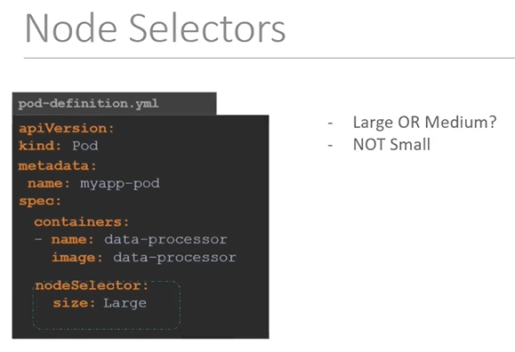
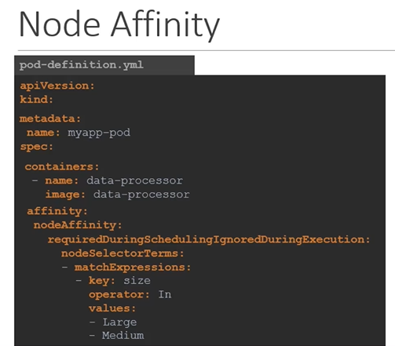
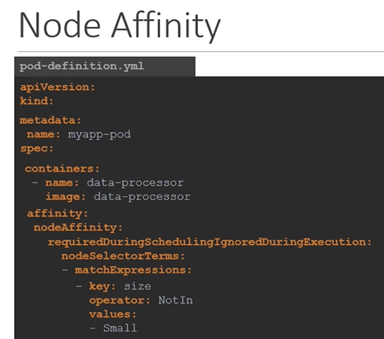
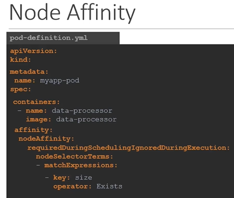
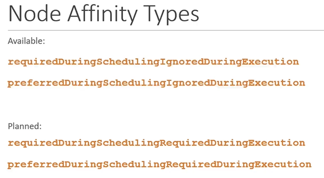
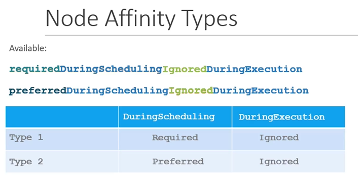
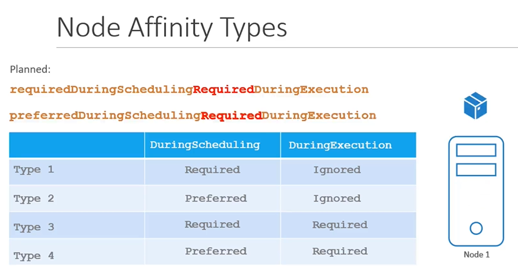

# Node Affinity
  - Take me to the [Video Tutorial](https://kodekloud.com/topic/node-affinity-2/)
  
In this section, we will talk about "Node Affinity" feature in kubernetes.

#### The primary feature of Node Affinity is to ensure that the pods are hosted on particular nodes.
- With **`Node Selectors`** we cannot provide the advance expressions.
  ```
  apiVersion: v1
  kind: Pod
  metadata:
   name: myapp-pod
  spec:
   containers:
   - name: data-processor
     image: data-processor
   nodeSelector:
    size: Large
  ```
  
  ```
  apiVersion: v1
  kind: Pod
  metadata:
   name: myapp-pod
  spec:
   containers:
   - name: data-processor
     image: data-processor
   affinity:
     nodeAffinity:
       requiredDuringSchedulingIgnoredDuringExecution:
          nodeSelectorTerms:
          - matchExpressions:
            - key: size
              operator: In
              values: 
              - Large
              - Medium
  ```
  
  
  ```
  apiVersion: v1
  kind: Pod
  metadata:
   name: myapp-pod
  spec:
   containers:
   - name: data-processor
     image: data-processor
   affinity:
     nodeAffinity:
       requiredDuringSchedulingIgnoredDuringExecution:
          nodeSelectorTerms:
          - matchExpressions:
            - key: size
              operator: NotIn
              values: 
              - Small
  ```
  
  
  ```
  apiVersion: v1
  kind: Pod
  metadata:
   name: myapp-pod
  spec:
   containers:
   - name: data-processor
     image: data-processor
   affinity:
     nodeAffinity:
       requiredDuringSchedulingIgnoredDuringExecution:
          nodeSelectorTerms:
          - matchExpressions:
            - key: size
              operator: Exists
  ```
  
  
  

## Node Affinity Types
- Available
  - requiredDuringSchedulingIgnoredDuringExecution
  - preferredDuringSchedulingIgnoredDuringExecution
- Planned
  - requiredDuringSchedulingRequiredDuringExecution
  - preferredDuringSchedulingRequiredDuringExecution
  
  
  
## Node Affinity Types States

  
  
  
  
#### K8s Reference Docs
- https://kubernetes.io/docs/tasks/configure-pod-container/assign-pods-nodes-using-node-affinity/
- https://kubernetes.io/blog/2017/03/advanced-scheduling-in-kubernetes/
