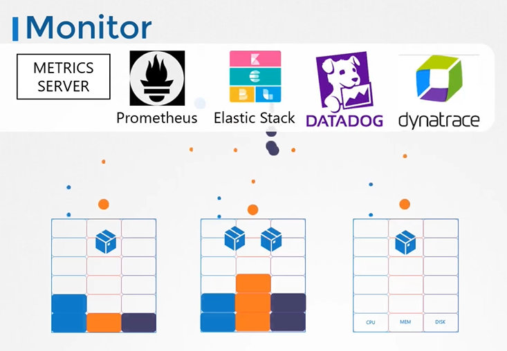
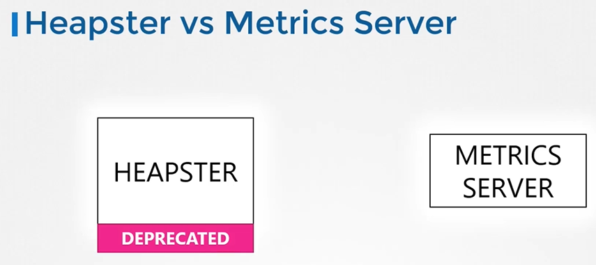
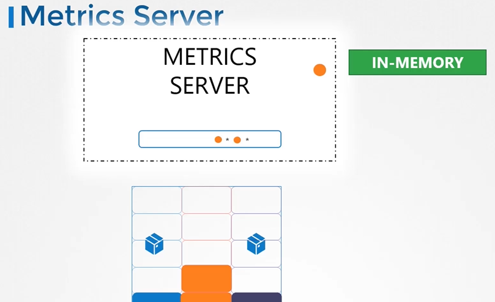
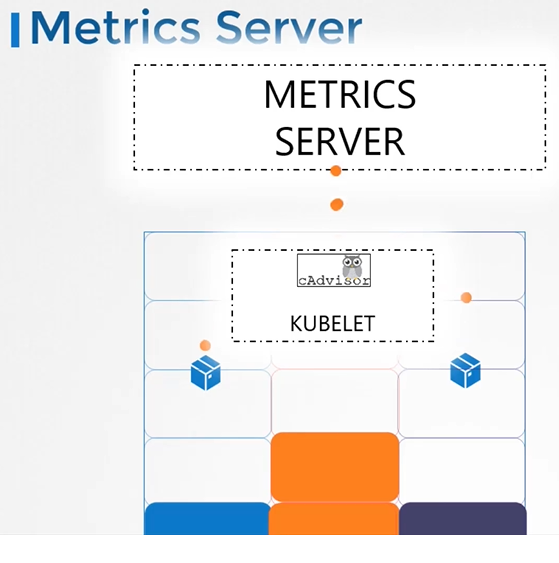
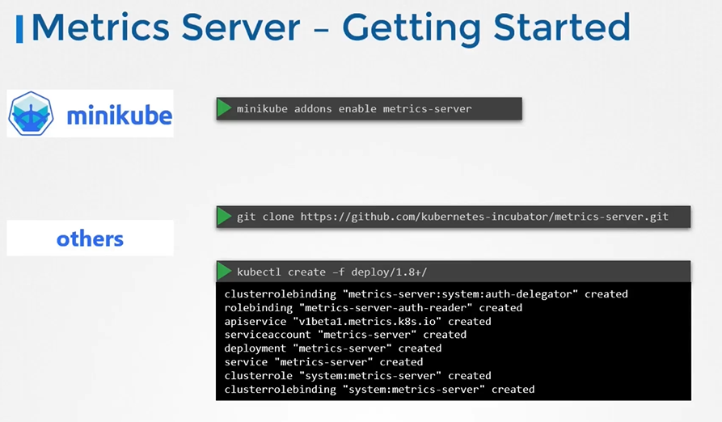
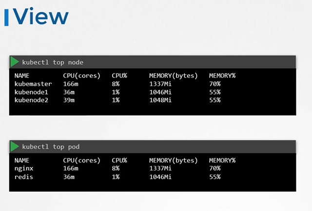

# Monitor Cluster Components
  - Take me to [Video Tutuorials](https://kodekloud.com/topic/monitor-cluster-components/)
  
In this section, we will take a look at monitoring kubernetes cluster

#### How do you monitor resource consumption in kubernetes? or more importantly, what would you like to monitor?
  
 
## Heapster vs Metrics Server
- Heapster is now deprecated and a slimmed down version was formed known as the **`metrics server`**.

  
  
## Metrics Server

  

#### How are the metrics generated for the PODs on these nodes?

  
  
## Metrics Server - Getting Started

  
  
- Clone the metric server from github repo
  ```
  $ git clone https://github.com/kubernetes-incubator/metrics-server.git
  ```
- Deploy the metric server
  ```
  $ kubectl create -f metric-server/deploy/1.8+/
  ```
  
- View the cluster performance
  ```
  $ kubectl top node
  ```
- View performance metrics of pod
  ```
  $ kubectl top pod
  ```
  
  
  
  
