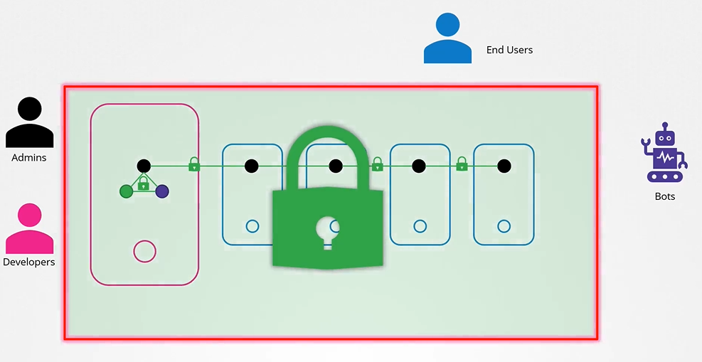
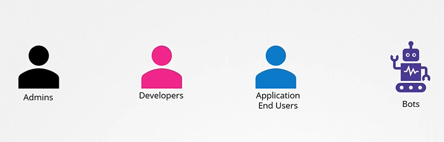
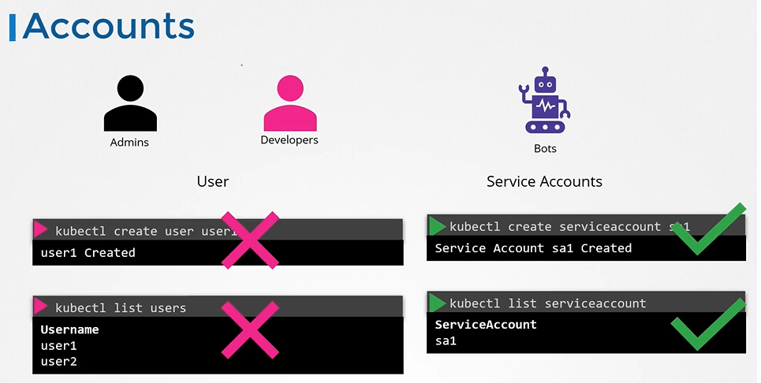
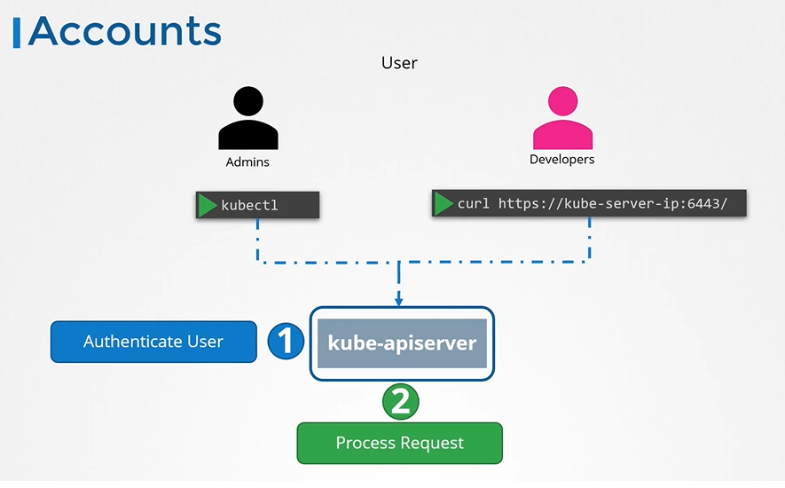
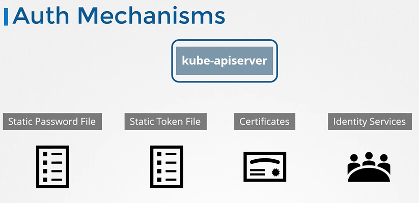
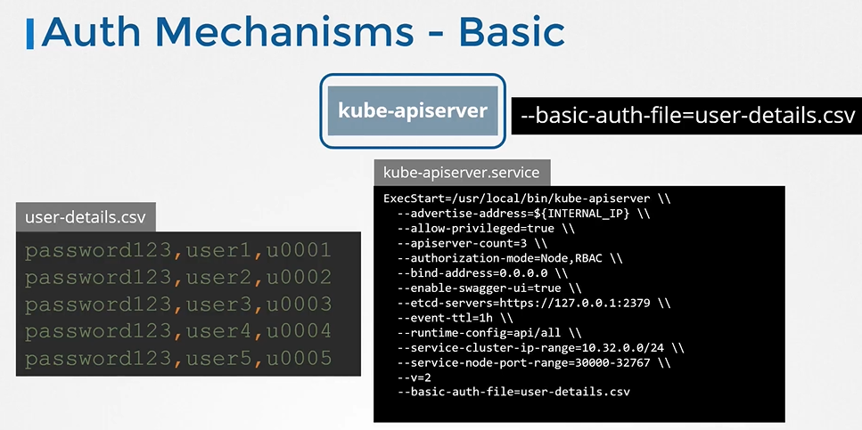
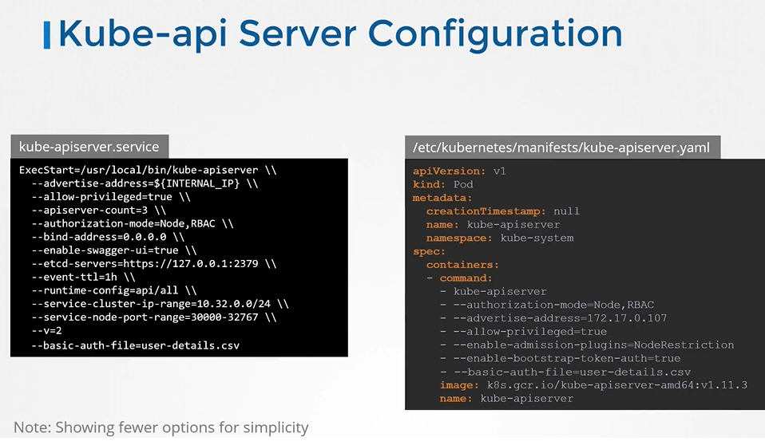
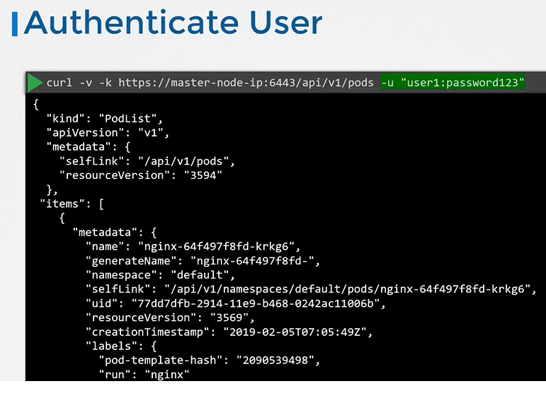
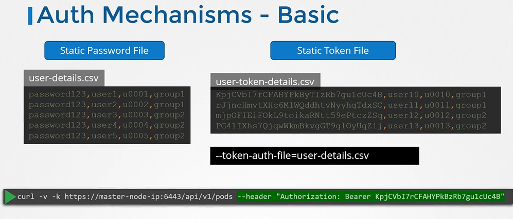
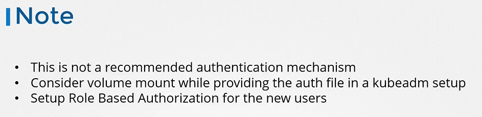

# Authentication
  - Take me to [Video Tutorial](https://kodekloud.com/topic/authentication/)
  
In this section, we will take a look at authentication in a kubernetes cluster

## Accounts

  
  
#### Different users that may be accessing the cluster security of end users who access the applications deployed on the cluster is managed by the applications themselves internally.

 
 
- So, we left with 2 types of users
  - Humans, such as the Administrators and Developers
  - Robots such as other processes/services or applications that require access to the cluster.
  

  
  
- All user access is managed by apiserver and all of the requests goes through apiserver.
 
  
  
## Authentication Mechanisms
- There are different authentication mechanisms that can be configured.

  
  
## Authentication Mechanisms - Basic
  
  
  
## kube-apiserver configuration
- If you set up via kubeadm then update kube-apiserver.yaml manifest file with the option.
  
  
  
## Authenticate User

- To authenticate using the basic credentials while accessing the API server specify the username and password in a curl command.
  ```
  $ curl -v -k http://master-node-ip:6443/api/v1/pods -u "user1:password123"
  ```
  
  
- We can have additional column in the user-details.csv file to assign users to specific groups.

  
  
## Note
 
 
  
  
#### K8s Reference Docs
- https://kubernetes.io/docs/reference/access-authn-authz/authentication/ 
  
  
