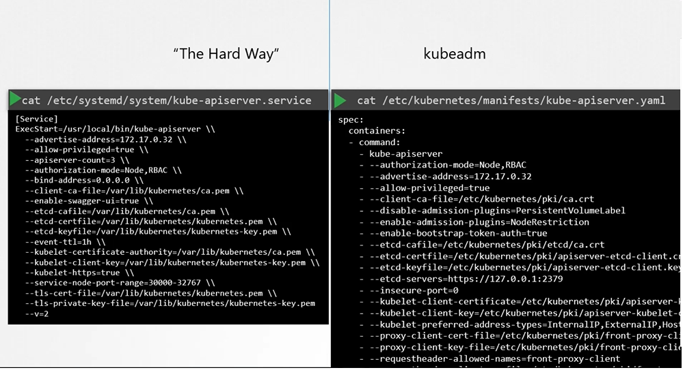
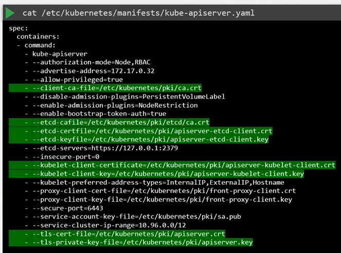
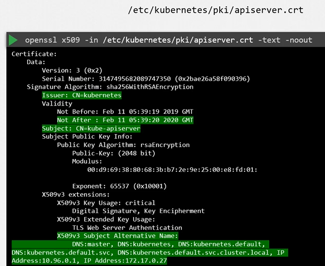
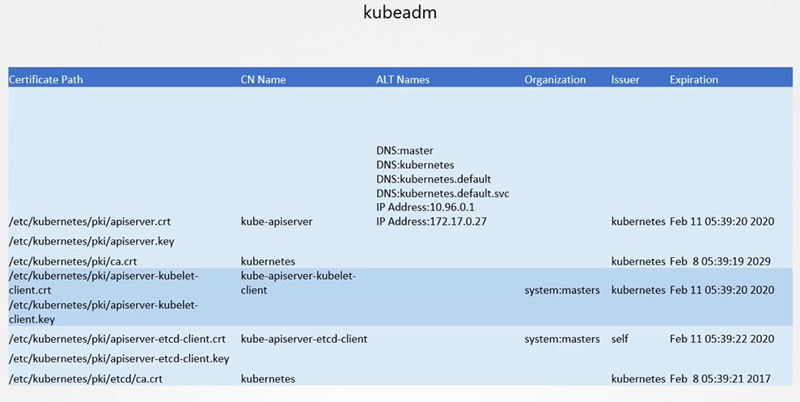
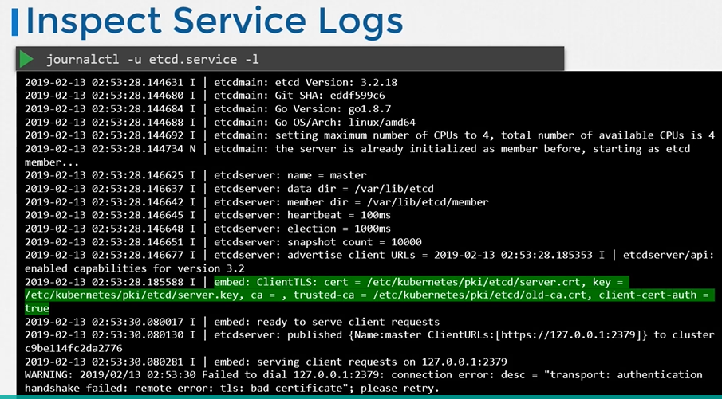
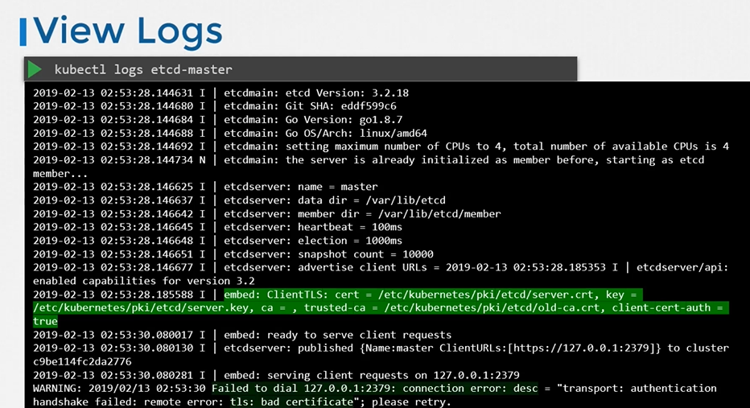
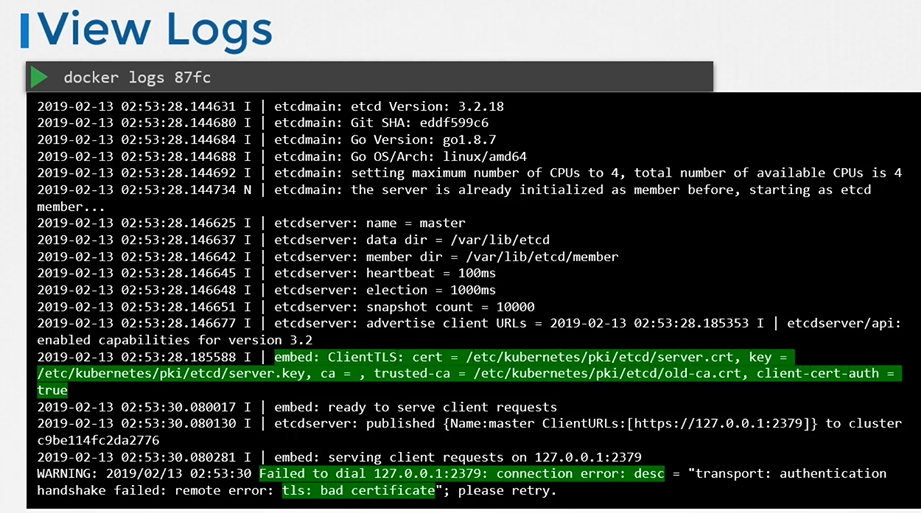

# View Certificate Details
  - Take me to [Video Tutorial](https://kodekloud.com/topic/view-certificate-details/)
  
In this section, we will take a look how to view certificates in a kubernetes cluster.

## View Certs 
 

 
 
 - To view the details of the certificate
   ```
   $ openssl x509 -in /etc/kubernetes/pki/apiserver.crt -text -noout
   ```
   
   
   
#### Follow the same procedure to identify information about of all the other certificates

   
   
## Inspect Server Logs - Hardware setup
- Inspect server logs using journalctl
  ```
  $ journalctl -u etcd.service -l
  ```
  
  
  
## Inspect Server Logs - kubeadm setup
- View logs using kubectl
  ```
  $ kubectl logs etcd-master
  ```
  
  
- View logs using docker ps and docker logs
  ```
  $ docker ps -a
  $ docker logs <container-id>
  ```
  
  
#### K8s Reference Docs
- https://kubernetes.io/docs/setup/best-practices/certificates/#certificate-paths
  
  

  

   
   

